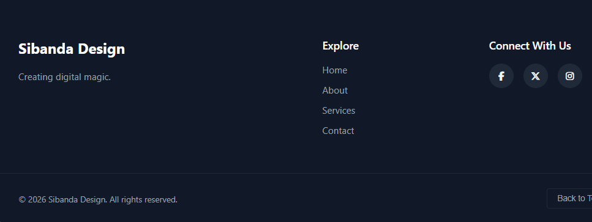

# Footer1 React Component

A reusable responsive footer component built with React.js.

---

## Screenshot



---

## Features

- React functional component
- useState and useEffect hooks
- Dynamic copyright year
- Scroll-to-top button
- Responsive layout
- Font Awesome icons

---

## Installation

```bash
npm install
npm start
```