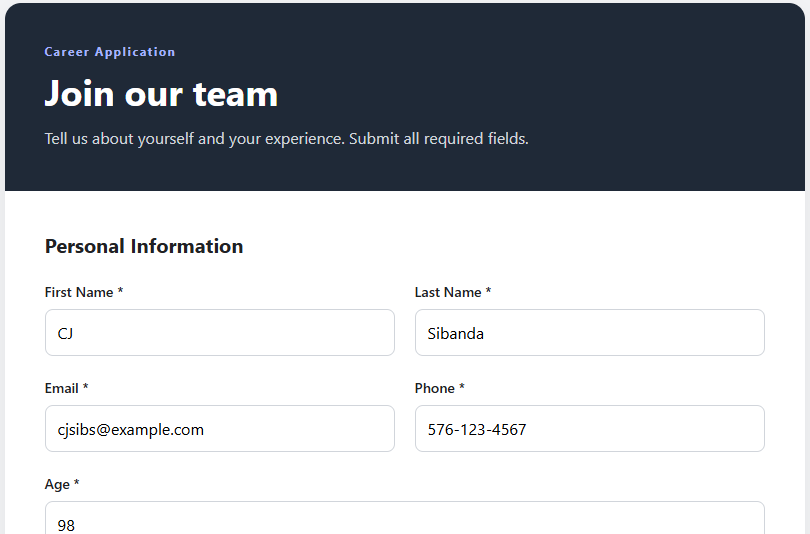

# React Job Application Form

A small React project built to demonstrate form development using **React Hook Form**.

## Screenshot



## What This Project Covers

This project demonstrates some key React Form concepts

* React Hook Form with `useForm()`
* Registering form controls with `register()`
* Handling submissions with `handleSubmit()`
* Setting initial values with `defaultValues`
* Updating form values with `setValue()`
* Watching form values with `watch()`
* Built-in validation rules such as:

  * `required`
  * `min`
  * `max`
  * `minLength`
  * `maxLength`
  * `pattern`
* Custom validation with `validate`
* Displaying validation errors with `formState.errors`
* Highlighting invalid fields with CSS
* Disabling the submit button when validation errors exist
* Working with inputs, selects, multiple selects, radio buttons, checkboxes, and textareas
* Simulating data loaded from an API using `useEffect()`

## Technologies

* React
* Vite
* React Hook Form
* CSS
* GitHub Codespaces

## Running the Project

Install the dependencies:

```bash
npm install
```

Start the development server:

```bash
npm run dev
```


## Purpose

The purpose of this project is to demonstrate building realistic React forms and understand the flow from:

**Form → Validation → JavaScript Object → API Request**
