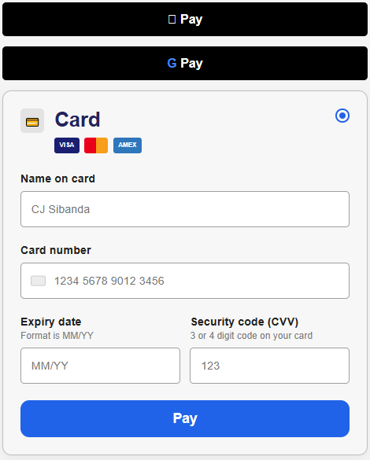

# Checkout Payment UI (React.js)

A reusable checkout/payment interface built with React.js, HTML, CSS, and JavaScript.

## Features

* Responsive design
* Card formatting
* Expiry date formatting
* CVV validation
* Apple Pay and Google Pay buttons

## Screenshot



## Run the Project

```bash
npm install
npm start
```

The app runs on:

```txt
http://localhost:3000
```
