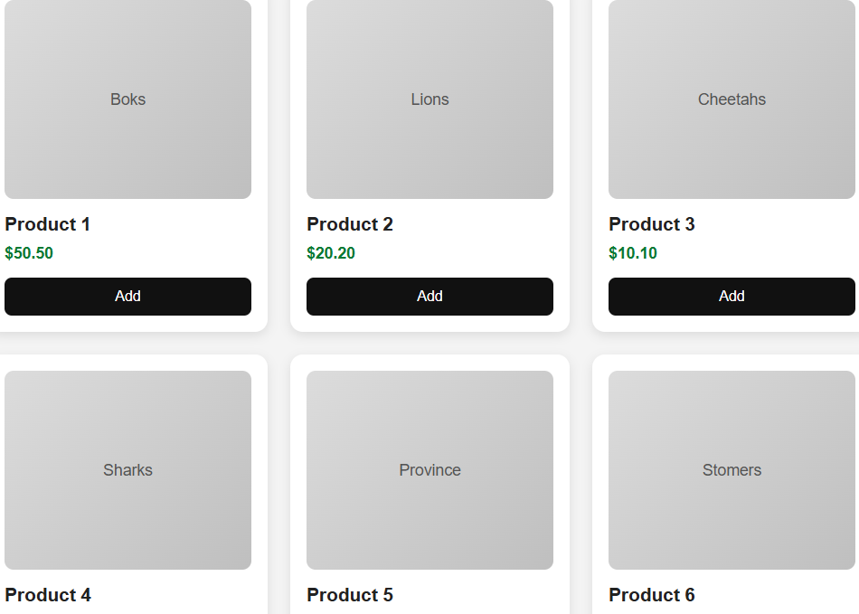

# Products Grid Component

Sibanda design reusable ecommerce product grid component built with:

- HTML
- CSS
- Vanilla JavaScript

## Features

- 6 reusable product cards
- Responsive CSS Grid layout
- Desktop: 3 columns
- Tablet: 2 columns
- Mobile: 1 column
- Hover animations
- Interactive Add button
- Clean modern UI

## Preview



## Folder Structure

```txt
productsGrid1/
├── images/
│   └── product_grid1.png
├── index.html
├── styles.css
├── script.js
└── README.md
```

## How To Run

Using NPX:

```bash
npx live-server
```

OR

```bash
npx serve
```