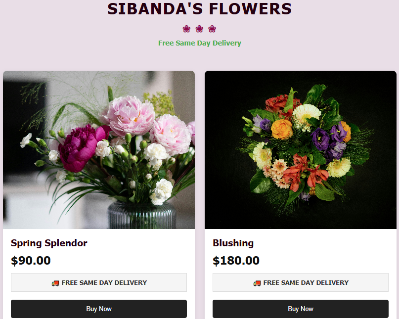

# Sibanda's Flowers Product Grid

A responsive product grid component built with vanilla HTML, CSS, and Vanilla JavaScript 

## Screenshot



## Features

* Responsive CSS Grid layout
* 3 cards across on desktop
* 2 cards across on tablet
* 1 card across on mobile

## Technologies Used

* HTML5
* CSS3 (CSS Grid, Flexbox, Media Queries)
* Vanilla JavaScript

## Getting Started


Using Node.js:

```bash
npx serve
```

Then open the URL shown in the terminal (for example, `http://localhost:3000`).

## Project Structure

```text
flowershop/
│
├── index.html
├── css/
│   └── styles.css
├── js/
│   └── script.js
└── images/
    ├── flower1.jpg
    ├── flower2.jpg
    ├── flower3.jpg
    └── flowers_screenshot.png
```

## Future Improvements

* Dynamic product loading from JavaScript or an API
* Shopping cart functionality
* Product detail pages
* Search and filtering
* Backend integration

